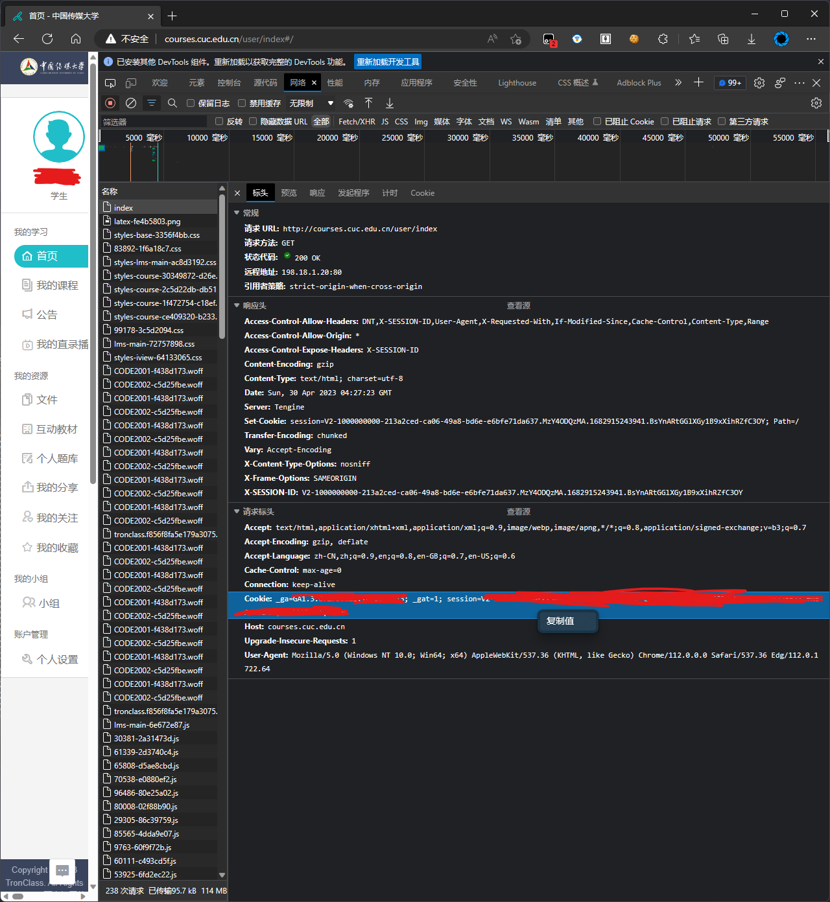

# CUC畅课自动获取

## 使用方法

1. 下载源码。
2. 浏览器打开畅课。
3. 按下F12，选择网络（`Network`），复制页面。
4. 点击`Index`，找到`Cookies`,右键复制值。
  
5. 打开`headers.json`，粘贴到`Cookies`对应的值。
6. 在终端运行`main.py`

## 目前实现的功能

- 根据Cookies自动获取课程的标题和截止时间

## 未来将要实现的功能

- 可以获取更多信息，例如作业和试卷、作业详情
- 增加GUI
- 接入Home Assistant
- 自动登录并保存Cookies
